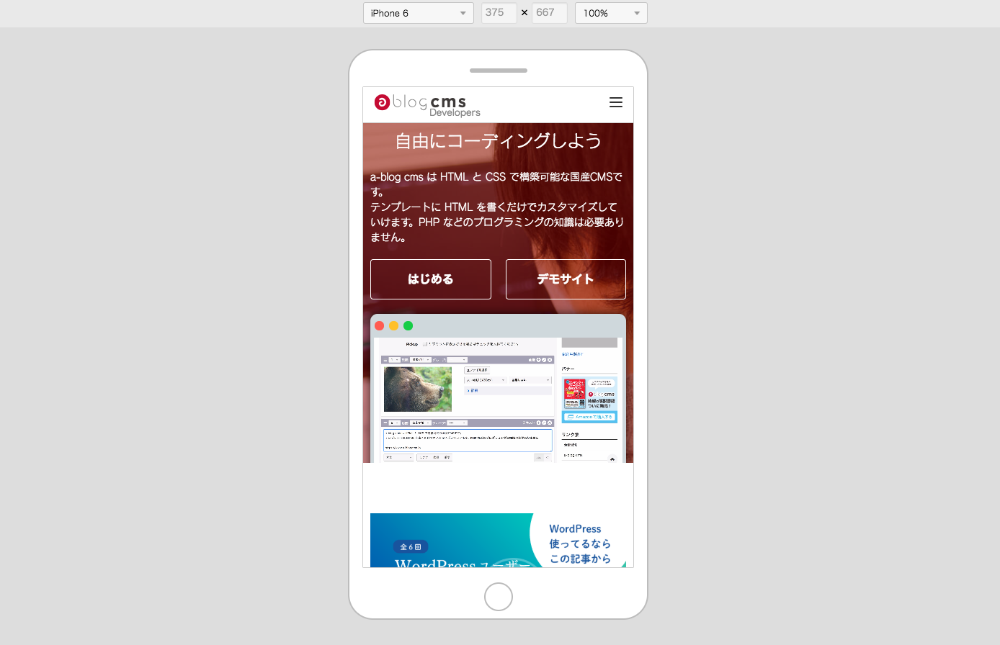

# react-device-mode



# Install

```sh
$ npm install react-device-mode --save
```

# Usage

```js
<ReactDeviceMode
  src={src}
  i18n={{ fitWindow: '画面サイズにあわせる' }}
  onClose={() => {}}
  devices={[
    {
      name: 'PC',
      ua: 'none',
      width: window.innerWidth - 100,
      height: window.innerHeight - 300,
      resizable: true
    },
    {
      name: 'iPhone 6/7/8',
      ua: 'Mozilla/5.0 (iPad; CPU OS 11_0 like Mac OS X) AppleWebKit/604.1.38 (KHTML, like Gecko) Version/11.0 Mobile/15A372 Safari/604.1',
      width: 375,
      height: 667,
      resizable: false
    },
  ]}
/>);
```

# Options
|Name|Default|Description|
| ------ |---|---|
| src | - | Set the URL of the page you want to display. |
| defaultDevice | - | First, set the device to be displayed. |
| devices | - | Set the device information that can be displayed. |
| hasHstoryDevice | true | Saves the most recently used device method　in local storage. |
| historyDeviceKey | 'reactDeviceModeHistory' | Set the local storage key. |
| hasCloseBtn | true | Sets the display of the close button. |
| isLoading | false | Set loading display. |
